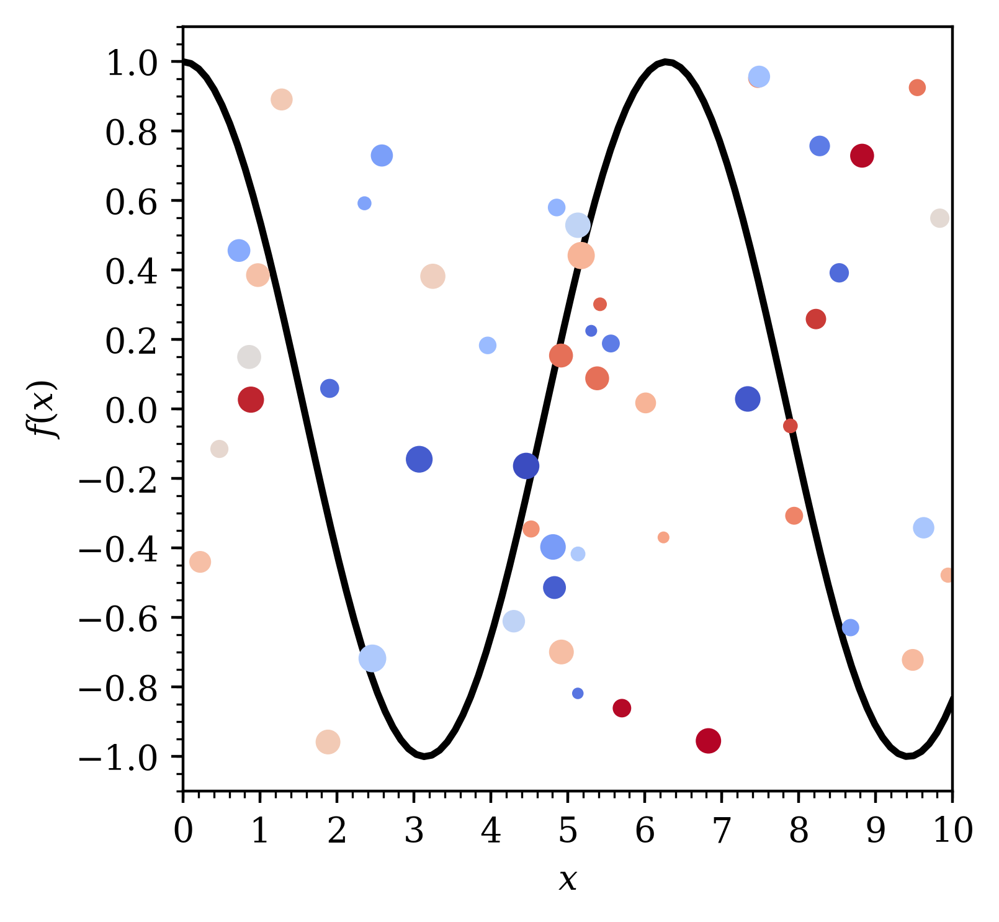

************
Tutorial
************
The package is based on two classes, ``DataSet`` and ``Plot``. Each ``DataSet`` class holds cartesian coordinates and the intended plot type.
These sets can then be added to a ``Plot`` object, which handles the plotting process.

In general the package is designed to produce nice plots with as few settings as possible, but also for plots to be fully customisable if required.

The DataSet Class
#################
A simple example of of making two data sets is as follows:

.. code:: python

    import numpy as np
    from mpl_scipub.dataset import DataSet

    # Generate data
    cosine = np.zeros((100,2))
    cosine[:,0] = np.linspace(0,10,100)
    cosine[:,1] = np.cos(cosine[:,0])

    random = np.zeros((50,2))
    random[:,0] = np.random.uniform(0,10,50)
    random[:,1] = np.random.uniform(-1,1,50)
    random_size = np.random.uniform(5,50,50)
    random_colour = np.random.uniform(0,1,50)

    # Make DataSet specifying properties on instantiation
    dataset_a = DataSet(cosine, plot='line', label='cosine', colour='black', line_width=2)

    # Make DataSet specifiying properties through setters
    dataset_b = DataSet(random, plot='scatter', label='random')
    dataset_b.set_marker(style='o',size=random_size)
    dataset_b.set_colour(map='coolwarm',colour=random_colour)

The list of methods is given below.

.. autoclass:: mpl_scipub.dataset.DataSet
    :members: set_bar, set_colour, set_contours, set_line, set_marker, set_error, __init__
    :private-members: init

The Plot Class
#################
The data sets abbove can be plotted using the plot class as follows:

.. code:: python

    from mpl_scipub.plotter import Plot

    # Make Plot class and add DataSets
    plot = Plot()
    plot.add_dataset(dataset_a)
    plot.add_dataset(dataset_b)

    # Adjust plot properties
    plot.set_axes(xlim=(0,10),xticks=(1,0.2),yticks=(0.2,0.05),xlabel=r'$x$',ylabel=r'$f\left(x\right)$') # Latex-style labels

    # Plot graphs
    plot.plot()
    plot.save(fmt='png')
    plot.display()

The list methods is given below.

.. autoclass:: dormrod_mpl.plotter.Plot
    :members: add_dataset, set_plot_size, set_text, set_legend, set_dimensions, set_axes, set_view, plot, display, save
